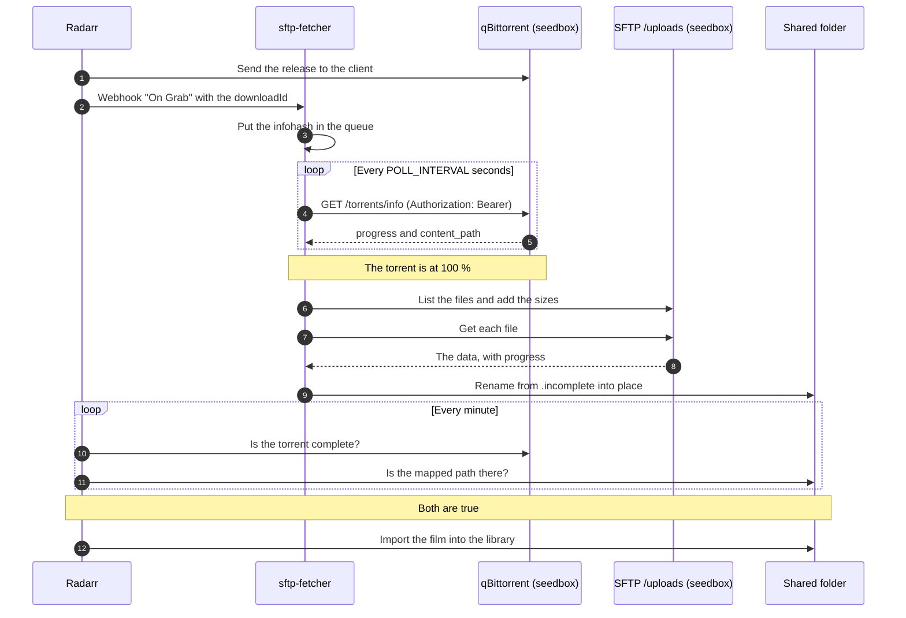

# sftp-fetcher

A small service that brings finished torrents from a remote seedbox to the
Radarr host.

Radarr and the download client are on different machines. Radarr cannot import
a file that is not on its own disk. This service closes that gap: Radarr says
"I grabbed something", the service waits for the torrent, copies the data, and
puts it where the Radarr **Remote Path Mapping** expects it. Radarr then
imports the film by itself.

The Radarr container stays as it is. No script goes inside it.

It can copy the data two ways, set by `TRANSFER_MODE`:

- **`sftp`** (the default) — the seedbox over SFTP. Simple, but slow.
- **`p2f`** — a [peer-to-file](https://github.com/murilopereirame/peer-to-file)
  server, over its authenticated, encrypted, resumable HTTP webseed. Much
  faster and steadier on a lossy link. The transport lives in
  [p2f-lib](https://github.com/murilopereirame/p2f-lib). See
  [Transfer mode](#the-transfer-mode) below.

## How it works



The download goes into `.incomplete/<infohash>/` first. The move into place is
one filesystem operation, so Radarr never sees a part file.

The download resumes. If the link drops, the part files stay in
`.incomplete/`, and the next try reads each remote file from the byte it
reached (an SFTP offset) and appends the rest. Nothing already copied is lost.
This holds across a retry, a later pass, and a container restart, because
`.incomplete/` is on the download volume.

The data on the seedbox is never deleted. Seeding continues.

## Requirements

- An SFTP account on the seedbox that shows the torrent data (`/uploads`).
- The qBittorrent Web API, reachable from the Radarr host.
- One folder that this service and the Radarr container both mount.
- Node.js 20 or later, for a local run. Docker needs nothing else.

## Quick start

1. Make a qBittorrent API key: **Options > Web UI > API keys > Generate**.
   (This needs qBittorrent 5.2.0 or later. For older versions, see
   `QBIT_AUTH` below.)
2. Put the SFTP password in `sftp_password.txt` next to the compose file.
3. Set the paths and the addresses in `docker-compose.yml`.
4. Start it:

   ```bash
   docker compose up -d --build
   docker compose logs -f
   ```

5. In Radarr, add the webhook and the path mapping. See the next section.
6. Open the web panel at `http://<this-host>:8080/` to watch the progress.

## The Radarr settings

### The webhook

**Settings > Connect > + > Webhook**

| Field | Value |
| --- | --- |
| Name | `sftp-fetcher` |
| On Grab | on |
| All other triggers | off |
| URL | `http://sftp-fetcher:8080/radarr` |
| Method | POST |

Press **Test**. One line must show in the log. Then press **Save**.

Radarr and this service must share a Docker network. If Radarr cannot find the
name `sftp-fetcher`, publish the port and use the host address.

### The remote path mapping

**Settings > Download Clients > Remote Path Mapping > +**

| Field | Example |
| --- | --- |
| Host | the qBittorrent host, as Radarr knows it |
| Remote Path | `/downloads/` |
| Local Path | `/data/downloads/` |

## The paths

Four names for the same tree. They must agree, or nothing is imported.

| Where | Setting | Example |
| --- | --- | --- |
| qBittorrent, on the seedbox | `QBIT_ROOT` | `/downloads` |
| The SFTP server, on the seedbox | `REMOTE_DIR` | `/uploads` |
| The peer-to-file shared root | `P2F_REMOTE_DIR` | `` (root) |
| This container | `LOCAL_ROOT` | `/downloads` |
| The Radarr container | Local Path, in the mapping | `/data/downloads` |

The service keeps the part of the path after the root. A torrent at
`/downloads/movies/Film.2024` on the seedbox becomes `/uploads/movies/Film.2024`
over SFTP (or `movies/Film.2024` inside the peer-to-file shared root), and
`/downloads/movies/Film.2024` in this container. Radarr sees
`/data/downloads/movies/Film.2024`.

Put `LOCAL_ROOT` on the same filesystem as the media library. Radarr then moves
the film. If not, Radarr copies it a second time.

## The settings

| Variable | Default | What it does |
| --- | --- | --- |
| `TRANSFER_MODE` | `sftp` | `sftp` or `p2f`. See below. |
| `SFTP_HOST` | — | The seedbox address. Required in the `sftp` mode. |
| `SFTP_PORT` | `22` | The SFTP port. |
| `SFTP_USER` | `torrent` | The SFTP user. |
| `SFTP_PASSWORD` | — | The password. Use the file below instead. |
| `SFTP_PASSWORD_FILE` | — | A file with the password on the first line. |
| `REMOTE_DIR` | `/uploads` | The folder that the SFTP server shows. |
| `P2F_URL` | — | The peer-to-file server. Required in the `p2f` mode. |
| `P2F_TOKEN` | — | A `p2f_...` API token. Use the file below instead. |
| `P2F_TOKEN_FILE` | — | A file with the token on the first line. |
| `P2F_REMOTE_DIR` | `` | A prefix inside the server's shared root. Empty is the root. |
| `P2F_VERIFY` | `true` | Check each finished file against the server's SHA-256. |
| `P2F_IDLE_TIMEOUT_MS` | `60000` | Drop a stalled connection after this many ms. |
| `QBIT_URL` | — | The qBittorrent Web API address. Required. |
| `QBIT_AUTH` | see below | `apikey`, `password`, or `none`. |
| `QBIT_API_KEY` | — | The key. It starts with `qbt_`. |
| `QBIT_USER` | `admin` | For the `password` mode only. |
| `QBIT_PASS` | `adminadmin` | For the `password` mode only. |
| `QBIT_ROOT` | `/downloads` | The prefix that qBittorrent reports. |
| `LOCAL_ROOT` | `/downloads` | The download folder in this container. |
| `STATE_DIR` | `/state` | The queue and the done list. |
| `LISTEN_PORT` | `8080` | The webhook port. |
| `WEBHOOK_PATH` | `/radarr` | The webhook path. |
| `POLL_INTERVAL` | `60` | Seconds between two passes over the queue. |
| `MAX_WAIT_HOURS` | `48` | A job stops after this time. |
| `COPY_TRIES` | `3` | Attempts for one download. |
| `COPY_WAIT` | `60` | Seconds between two attempts. |
| `PROGRESS_INTERVAL` | `15` | Seconds between two progress lines. |

### The qBittorrent authentication

| `QBIT_AUTH` | What it does | When to use it |
| --- | --- | --- |
| `apikey` | `Authorization: Bearer qbt_...` | qBittorrent 5.2.0 or later. |
| `password` | Login, then the session cookie. | Older versions. |
| `none` | No credentials. | qBittorrent whitelists this IP. |

Set `QBIT_API_KEY` and leave `QBIT_AUTH` out, and the service picks `apikey`.

## The transfer mode

`TRANSFER_MODE` chooses how the file data is copied. qBittorrent is still the
source of truth about which torrent is done and where it lives; only the copy
step changes.

| `TRANSFER_MODE` | Source | Notes |
| --- | --- | --- |
| `sftp` | The seedbox over SFTP. | The default. Simple, but slow. |
| `p2f` | A peer-to-file server. | Authenticated, encrypted, resumable HTTP. Faster and steadier. |

Both modes resume: a stopped copy keeps its bytes in `.incomplete/` and the
next pass finishes from the byte it reached. The active mode is shown in the
web panel header and in `GET /status` (the `mode` field).

### The p2f mode

Point `P2F_URL` at your [peer-to-file](https://github.com/murilopereirame/peer-to-file)
server (over the same VPN as the seedbox) and give it an API token. Make a
token on the server:

```sh
node src/server/cli.ts add-token <user> <name>   # prints a p2f_... token once
```

Set it as `P2F_TOKEN`, or, better, `P2F_TOKEN_FILE` pointing at a Docker
secret. The service fetches files over the server's HTTP webseed with byte-range
resume, decrypts the AES-256-CTR stream as it arrives (the key is ECDH-wrapped
per transfer, never sent in the clear), and checks each finished file against
the server's plaintext SHA-256. All of that lives in the standalone
[p2f-lib](https://github.com/murilopereirame/p2f-lib) package — no WebTorrent,
no browser, no native modules.

If the peer-to-file tree is not at the shared root, set `P2F_REMOTE_DIR` to the
prefix, the same way `REMOTE_DIR` works for SFTP.

## The web panel

Open `http://<this-host>:8080/` in a browser. The panel is like the one in
Sonarr and Radarr. It refreshes by itself. It has four tabs:

| Tab | What it shows |
| --- | --- |
| Activity | The running download, with a progress bar, and the queue. |
| Files | The files that this service put on the local disk. |
| History | Every event: grabbed, downloaded, failed, expired. |
| Events | The last log lines, newest first. |

The panel is one page with no framework. It only reads the `/api` endpoints
below. Nothing is written from the browser.

## The HTTP endpoints

| Method and path | What it gives |
| --- | --- |
| `GET /` | The web panel (HTML). |
| `POST /radarr` | The Radarr webhook. |
| `GET /status` | The queue and the running download, as JSON. |
| `GET /api/status` | The same, with raw numbers, for the panel. |
| `GET /api/history` | The history of events, newest first. |
| `GET /api/files` | The files on the local disk. |
| `GET /api/activity` | The last log lines. |
| `GET /health` | For the Docker health check. |

Example of `GET /status` during a transfer:

```json
{
  "mode": "sftp",
  "queue": [
    {
      "hash": "aabbccdd...",
      "title": "Film.2024.1080p.WEB-DL",
      "waitingSince": "2026-08-18T09:43:03.281Z"
    }
  ],
  "download": {
    "name": "movies/Film.2024",
    "percent": 18.7,
    "done": "2.2 MiB",
    "total": "11.7 MiB",
    "speed": "4.5 MiB/s",
    "timeLeft": "2s",
    "files": "0 of 3",
    "runningFor": "2s"
  }
}
```

## The log

```text
aabbccdd: Added to the queue. Title: 'Film.2024.1080p.WEB-DL'.
aabbccdd: 42.0 % complete. Wait.
aabbccdd: Download start: 'movies/Film.2024'.
aabbccdd: 69.3 % (8.1 MiB of 11.7 MiB) at 8.0 MiB/s, 24s left [file 1 of 3]
aabbccdd: Ready at '/downloads/movies/Film.2024'. Radarr can import it now.
```

## Development

```bash
npm ci
npm run build        # make dist/
npm start            # run it
npm run typecheck    # types only
npm test             # the unit tests
```

### The test SFTP server

`sftp-test-server.mjs` gives a small SFTP server for a local test. No seedbox
is necessary.

```bash
mkdir -p /tmp/seedbox/downloads/movies/Film.2024
head -c 12000000 /dev/urandom > /tmp/seedbox/downloads/movies/Film.2024/Film.mkv
node sftp-test-server.mjs        # port 2222, user "torrent", password "secret"
```

Then start the service against it and send a grab by hand:

```bash
curl -X POST http://localhost:8080/radarr \
  -H 'Content-Type: application/json' \
  -d '{"eventType":"Grab","downloadId":"<INFOHASH>","release":{"releaseTitle":"test"}}'
```

The same command adds a torrent that Radarr grabbed before the webhook existed.

### The tests

`npm test` compiles the sources with the tests and runs the Node test runner.
The suite covers the path map, the progress numbers, the queue on disk, and the
webhook, with no network and no seedbox.

## The files

| File | Job |
| --- | --- |
| `src/index.ts` | The entry point. It catches a bad setting. |
| `src/app.ts` | It starts the server and the worker. |
| `src/server.ts` | The webhook and the status endpoint. |
| `src/worker.ts` | The loop: poll, download, move. |
| `src/qbittorrent.ts` | The Web API client. |
| `src/fetcher.ts` | Picks the transport (SFTP or p2f) from the mode. |
| `src/sftp.ts` | The SFTP download, with progress. |
| `src/p2f.ts` | The peer-to-file download (via p2f-lib). |
| `src/paths.ts` | The path map. |
| `src/store.ts` | The queue and the history on disk. |
| `src/progress.ts` | The progress numbers and their form. |
| `src/files.ts` | The list of files on the local disk. |
| `src/events.ts` | The activity feed, in memory. |
| `src/panel.ts` | The web panel: one HTML page. |
| `src/config.ts` | All the environment variables. |

## The image

A GitHub release makes a new image. The workflow also starts by hand from the
Actions tab. The image goes to the GitHub Container Registry, for `amd64` and
`arm64`.

```bash
docker pull ghcr.io/<owner>/<repository>:latest
```

## Notes

- The service only knows the torrents that Radarr grabbed after the webhook
  started. Older downloads need the `curl` command above.
- One download runs at a time. A second grab waits. This protects a slow link.
- The queue is in `state/queue.json`. A restart does not lose a job.
- A dropped download resumes from where it stopped, even after a restart. The
  part files wait in `.incomplete/` on the download volume.
- The container user must have the same UID and GID as Radarr. If not, Radarr
  cannot move the files after the import.
